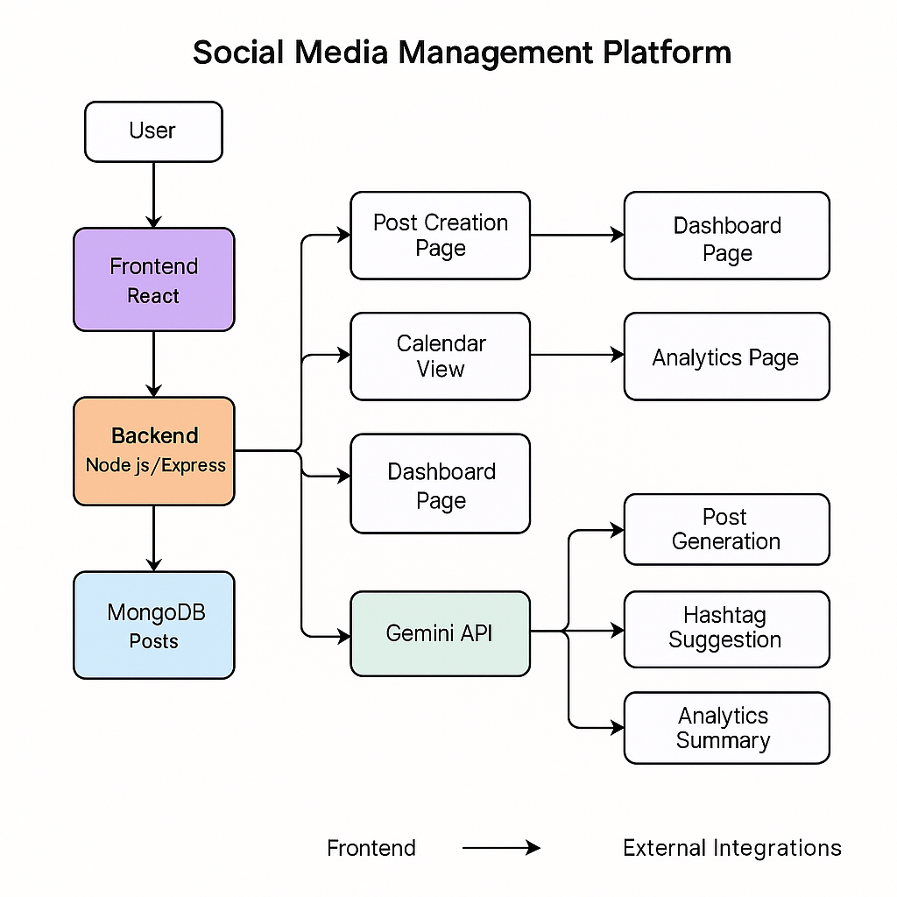
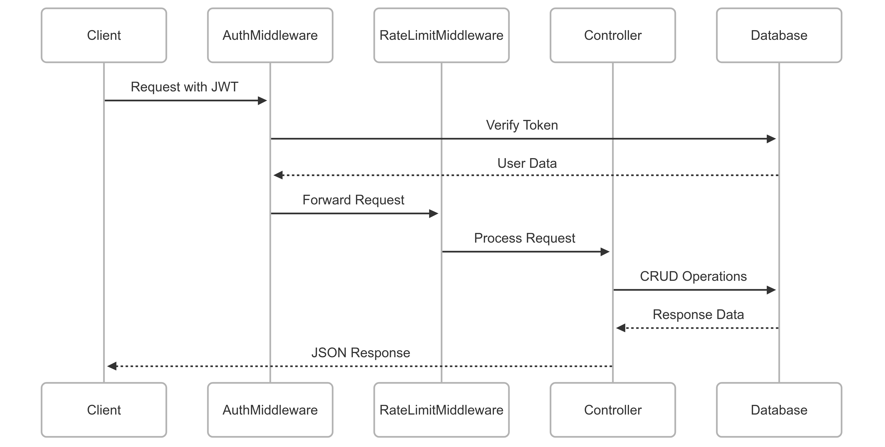
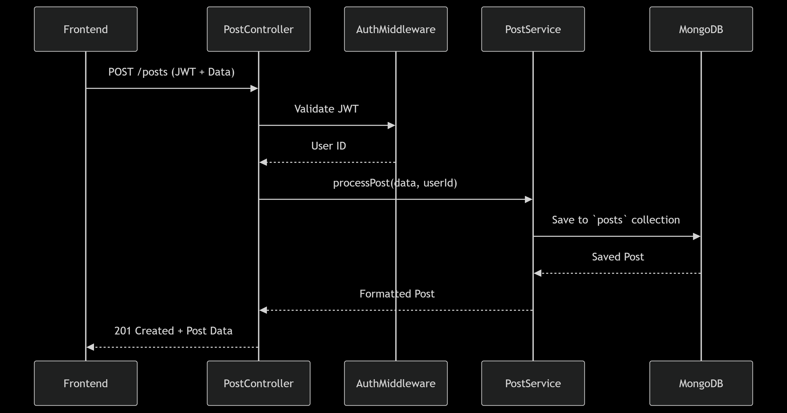
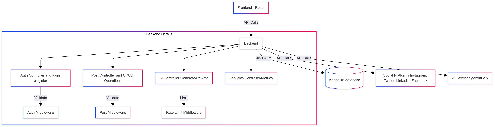

# **Social Media Manager API Documentation** 🚀

## **Overview**

A comprehensive API for managing social media posts, scheduling content, generating AI-powered captions, and analyzing engagement metrics. Built for **a** hackathon project.

---

### 📌 Developer Notes

#### 🚧 Current Status & Work in Progress

* **Some APIs are implemented but currently unused** , as they are intended for  **future expansion** . These have been retained for architectural flexibility.
* Due to recent changes in logic,  **certain APIs remain undocumented** .
  > **TODO** : Update and refine the API documentation accordingly.
  >

---

#### 🔧 Design Decisions & Improvements

* Initially, a **separate collection (`ScheduledPost`)** was created to store scheduled posts, distinct from the `Post` model.
* After evaluation, this approach was revised. For the current scope, we only kept posts model.
* This service (`services/scheduler.js`) was introduced to manage **automated publishing** of scheduled posts using the `node-schedule` library. [more to work upon on this]

---

#### 📈 Future Improvements & TODOs

* ✅ **Improve system scalability** by redesigning architecture for higher throughput and fault tolerance.
* ✅ **Write unit and integration tests** to identify bugs, edge cases, and potential logical errors.
* ✅ **Enhance the scheduling service** with better logic, error handling, and retry mechanisms.
* ✅  **Extend feature set with AI integrations** , e.g.:

  * Auto-caption generation
  * Optimal posting time predictions
  * Content quality suggestions
* ❗️ **Document AI-related APIs and endpoints** , which were added during the final integration phase and are currently missing from the official documentation.
* 🚀 **Optimize `services/scheduler.js`** for maintainability, performance, and robustness.

---

That's a great idea, Rounik! Including system design visuals and flow diagrams in your README adds tons of clarity for collaborators, recruiters, or future maintainers.

Here’s a clean and professional way you can structure your README sections for those diagrams:

---

## 📐 System Design & Architecture

### 🧪 Initial System Design (Rough Draft)

> This was our first approach to handling post scheduling and publishing logic. We explored separate collections for scheduled posts and regular posts.



---

### 🔁 Data Flow Diagram

> Illustrates how data flows through the system during the post creation, scheduling, and publishing lifecycle.



---

### 🧾 Post Creation Flow

> Describes the steps involved when a user creates a post.



---

### 🏗️ Final System Design (Refined)

> Our revised and production-ready design—merging scheduled and published posts into a unified collection while using a background service for automated publishing.



---

# **API DOCUMENTATION**

## **🔐 Authentication**

All protected routes require a **JWT token** in the `Authorization` header:

```
Authorization: Bearer [your_jwt_token]
```

### **1. Register User**

`POST /api/auth/register`
**Request Body:**

```json
{
  "username": "johndoe",
  "email": "john@example.com",
  "password": "password123"
}
```

**Response (201 - Created):**

```json
{
  "token": "jwt_token_here",
  "refreshToken": "refresh_token_here",
  "user": {
    "id": "user_id",
    "username": "johndoe",
    "email": "john@example.com"
  }
}
```

**Errors:**

- `400` – Missing fields / Invalid email
- `409` – Email already registered

---

### **2. Login**

`POST /api/auth/login`
**Request Body:**

```json
{
  "email": "john@example.com",
  "password": "password123"
}
```

**Response (200 - OK):**

```json
{
  "token": "jwt_token_here",
  "refreshToken": "refresh_token_here",
  "user": {
    "id": "user_id",
    "username": "johndoe",
    "email": "john@example.com"
  }
}
```

**Errors:**

- `401` – Invalid credentials
- `429` – Too many attempts (rate-limited)

---

### **3. Refresh Token**

`POST /api/auth/refresh-token`
**Request Body:**

```json
{
  "refreshToken": "refresh_token_here"
}
```

**Response (200 - OK):**

```json
{
  "token": "new_jwt_token",
  "refreshToken": "new_refresh_token"
}
```

**Errors:**

- `401` – Invalid/expired refresh token

---

## **📮 Posts Management**

### **1. Get All Posts**

`GET /api/posts`
**Response (200 - OK):**

```json
[
  {
    "_id": "post_id",
    "topic": "Post Title",
    "text": "Post content",
    "platform": "Instagram",
    "status": "draft",
    "scheduledDate": "2024-03-20T10:00:00Z",
    "createdAt": "2024-03-19T10:00:00Z"
  }
]
```

**Errors:**

- `401` – Unauthorized

---

### **2. Create Post**

`POST /api/posts`
**Request Body:**

```json
{
  "topic": "My Post",
  "text": "Post content here",
  "platform": "Instagram",
  "scheduledDate": "2024-03-20T10:00:00Z",
  "mediaFileName": "image.jpg",
  "aiGenerated": false
}
```

**Response (201 - Created):**

```json
{
  "_id": "post_id",
  "topic": "My Post",
  "text": "Post content here",
  "platform": "Instagram",
  "status": "draft",
  "scheduledDate": "2024-03-20T10:00:00Z",
  "mediaFileName": "image.jpg",
  "aiGenerated": false
}
```

**Errors:**

- `400` – Missing required fields
- `401` – Unauthorized

---

### **3. Get Posts by Platform**

`GET /api/posts/platform/:platform`**Parameters:**

- `platform`: `Instagram | Twitter | LinkedIn | Facebook`

**Response (200 - OK):**

```json
[
  {
    "_id": "post_id",
    "topic": "Post Title",
    "text": "Post content",
    "platform": "Instagram",
    "status": "draft"
  }
]
```

**Errors:**

- `404` – No posts found

---

### **4. Get Posts by Status**

`GET /api/posts/status/:status`**Parameters:**

- `status`: `draft | published | scheduled | failed`

**Response (200 - OK):**

```json
[
  {
    "_id": "post_id",
    "topic": "Post Title",
    "text": "Post content",
    "platform": "Instagram",
    "status": "published"
  }
]
```

**Errors:**

- `404` – No posts found

---

### **5. Update Post**

`PUT /api/posts/:id`
**Request Body:**

```json
{
  "topic": "Updated Title",
  "text": "Updated content",
  "platform": "Instagram",
  "scheduledDate": "2024-03-20T10:00:00Z"
}
```

**Response (200 - OK):**

```json
{
  "_id": "post_id",
  "topic": "Updated Title",
  "text": "Updated content",
  "platform": "Instagram",
  "scheduledDate": "2024-03-20T10:00:00Z",
  "updatedAt": "2024-03-19T10:00:00Z"
}
```

**Errors:**

- `404` – Post not found

---

### **6. Delete Post**

`DELETE /api/posts/:id`
**Response (200 - OK):**

```json
{
  "message": "Post deleted successfully"
}
```

**Errors:**

- `404` – Post not found

---

### **7. Get Analytics**

`GET /api/posts/analytics`
**Response (200 - OK):**

```json
{
  "totalPosts": 100,
  "engagementRate": "4.5",
  "platformStats": {
    "Instagram": {
      "postCount": 40,
      "totalLikes": 1200,
      "totalComments": 300,
      "totalShares": 150,
      "avgLikes": "30.0",
      "avgComments": "7.5",
      "avgShares": "3.8",
      "engagementRate": "41.3"
    }
  },
  "topPosts": [
    {
      "_id": "post_id",
      "topic": "Top Performing Post",
      "platform": "Instagram",
      "likes": 500,
      "comments": 100,
      "shares": 50
    }
  ],
  "recentPerformance": [
    {
      "label": "Posts Last Week",
      "value": 10,
      "change": 10
    }
  ]
}
```

---

## **🤖 AI Features**

### **1. Generate Post**

`POST /api/ai/generate-post`
**Request Body:**

```json
{
  "topic": "Digital Marketing",
  "tone": "professional",
  "platform": "LinkedIn"
}
```

**Response (200 - OK):**

```json
{
  "text": "Generated post content"
}
```

**Rate Limit:** `100 requests/hour`

---

### **2. Generate Hashtags**

`POST /api/ai/generate-hashtags`
**Request Body:**

```json
{
  "topic": "Digital Marketing",
  "platform": "Instagram"
}
```

**Response (200 - OK):**

```json
{
  "suggestions": {
    "hashtags": ["#digitalmarketing", "#socialmedia", "#marketing"],
    "emojis": ["📱", "💻", "📊"]
  }
}
```

**Rate Limit:** `100 requests/hour`

---

### **3. Rewrite Post**

`POST /api/ai/rewrite-post`
**Request Body:**

```json
{
  "caption": "Original post content"
}
```

**Response (200 - OK):**

```json
{
  "text": "Rewritten post content"
}
```

**Rate Limit:** `100 requests/hour`

---

### **4. Analyze Metrics**

`POST /api/ai/analyze-metrics`
**Request Body:**

```json
{
  "metrics": {
    "likes": 100,
    "reach": 1000,
    "comments": 25
  }
}
```

**Response (200 - OK):**

```json
{
  "analysis": {
    "engagementRate": "12.5%",
    "recommendations": ["Post more during peak hours", "Use more engaging visuals"]
  }
}
```

**Rate Limit:** `100 requests/hour`

---

## **⚡ Rate Limiting**

| Endpoint Type  | Limit                    |
| -------------- | ------------------------ |
| AI Endpoints   | 100 requests/hour        |
| Auth Endpoints | 5 failed attempts/minute |

---

## **📌 Best Practices [we followed]**

✅ I**ncluded JWT token** in `Authorization` header
✅ **Handled token expiration** using refresh tokens
✅ **Used proper HTTP methods** (`GET`, `POST`, `PUT`, `DELETE`)
✅ **Validated inputs** before sending requests
✅ **Implemented error handling** for API responses

---

## **🎯 Why This API Stands Out? [For now]**

✔ **JWT Authentication** – Secure token-based auth
✔ **AI-Powered Features** – Auto-generate captions
✔ **Analytics Dashboard** – Track engagement metrics
✔ **Rate Limiting** – Prevents abuse

---

**Made with ❤️ by Runtime Terrors...**
**Hackathon Submission 2025** 🏆
